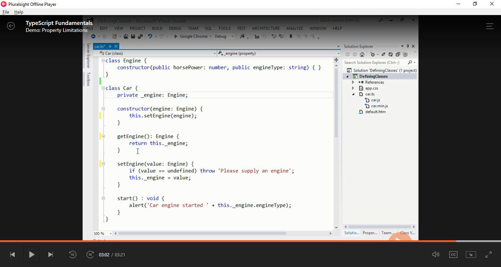
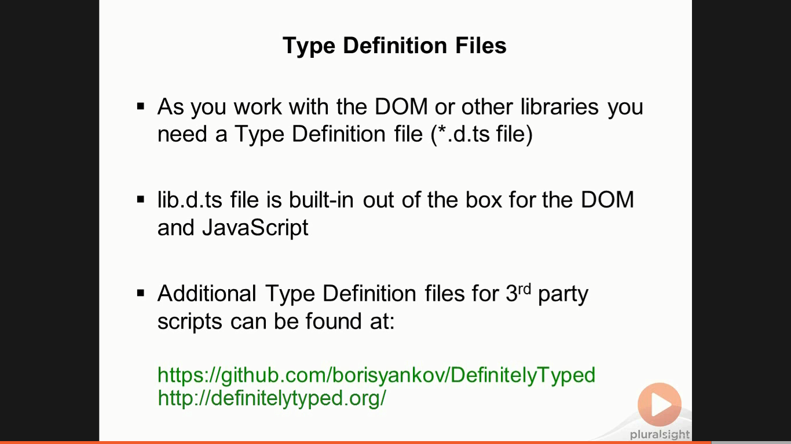
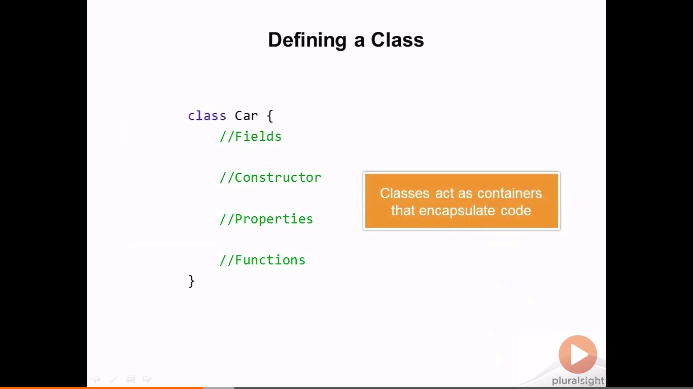
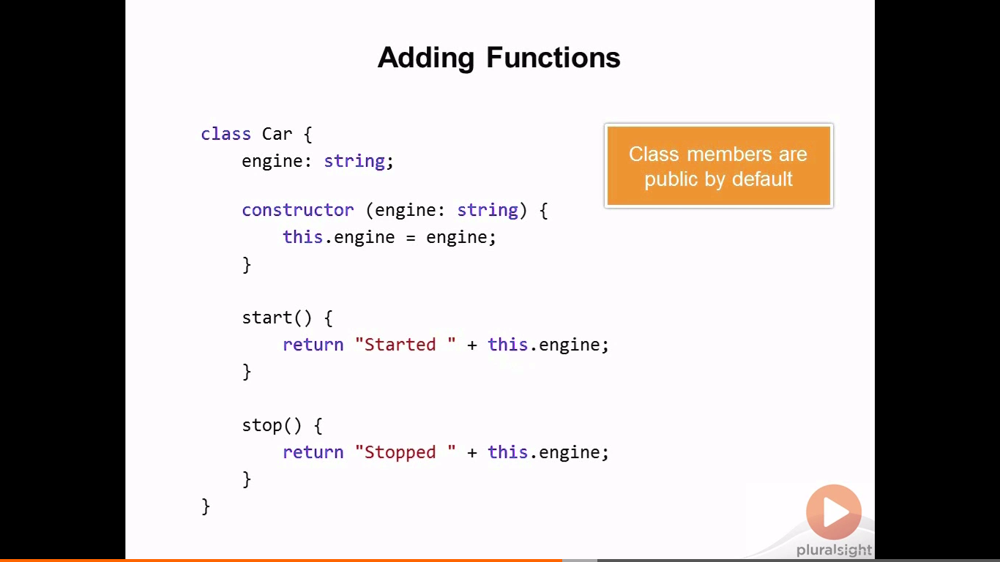
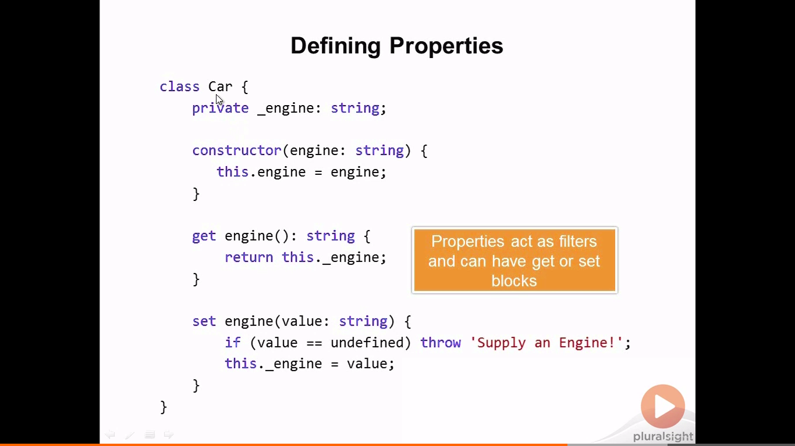
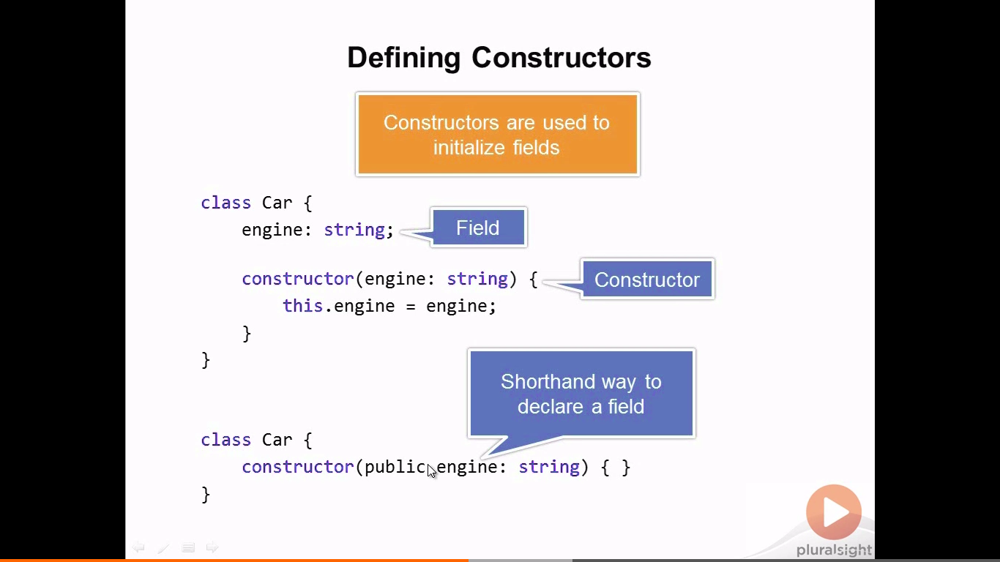

# Typescript Reference 

## 	Source - Typescript Fundamentals

### Important
#### 1 - Typescript compiles to ES5 so only newer or updated browsers can make use of this

#### 2 - The properties set for fields in classes compile to ES8 and ES9. To avoid this, either use the set get methods as written below, or use public properties
 

#### 3 - When using a compiler to compile a specific ES version use (only in windows)
`tsc.exe --target ES5 car.ts`

#### 4 - DefenitlyTyped.org contains libraries to use on Typescript

## Classes & Interfaces

#### 1 - Defining a Class 

 

#### 2 - Class members are public by default

#### 3 - Private properties can only be accessed by get and set methods

#### 4 - Field properties can be instantiated within constructor but property type must be defined (public or private) 

### Good Vids to follow up
* Demo: Casting and Type Definition Files C3:S6

