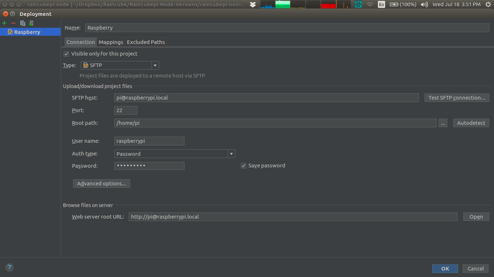
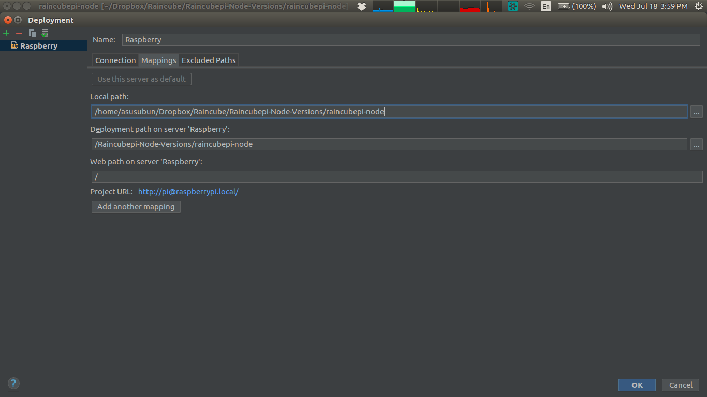

# Syncing Raspberrypi with Webstorm

#### 1 - Create Project Directory

#### 2 - Go to the top nav and press Tools >> Deployment >> Configuration

#### 3 - Create Deployment Access

#### 4 - Follow image below, and click on Autodetect in order to auto select root folder

#### NOTE - When setting raspberry pi network to 'Shared to other Computers' on method, it is necessary to set 'SFTP host' to pi@raspberrypi.local . Otherwise if network set to 'Link-Local Only' the SFTP host is required to be set on raspberrypi.local

#### 6 - Create on Raspberry pi the same directory as the project directory, and set the deployment location as the image below 

#### 7 - Press OK to end and close application in order to save 

#### 8 - To end, go to Tools >> Deployment >> 

